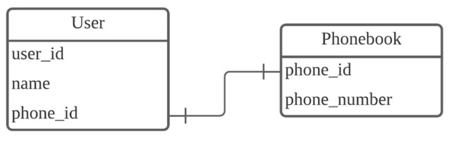
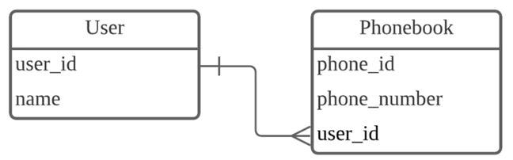
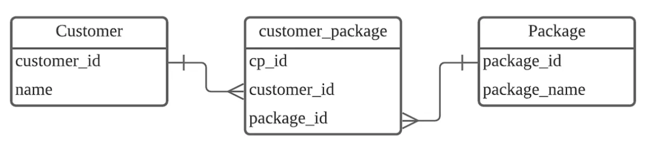

- 키란?
    - 데이터베이스에서 조건에 만족하는 튜플을 찾거나 순서대로 정렬할 때 다른 튜플들과 구별할 수 있는 기준이 되는 속성 or 속성들의 집합
- 외래키
    - foreign key
    - 두 테이블을 서로 연결하는데 사용되는 key
    - 부모 테이블 - 외래키 값을 제공하는 테이블
    - 자식 테이블 - 외래키가 포함된 테이블
    - 외래키 값은 NULL이거나 부모 테이블의 기본키 값과 동일해야 함.
    - 외래키는 데이터베이스에서 데이터 무결성을 유지하는 데 중요한 역할을 함
- 기본키
    - primary key
    - 후보키
        - candidate key
        - 키 중 유일성과 최소성을 모두 만족하는 속성들의 집합
    - 후보키들 중 메인으로 선정되는 key, 후보키의 성질을 가짐
    - 주의사항
        - 값의 변동이 잦은 후보키는 기본키로 부적절
        - NULL값을 가질 수 있는 속성이 포함된 후보키는 기본키로 부적절
        - 하나의 테이블에는 반드시 하나의 기본키만 존재
- ER 다이어그램
    - Entity-Relation Diagram(ERD) : 개체 관계도
    - 현실 세계의 요구사항들로부터 Database 설계 과정에서 활용
    - 개념을 모델링하는 개체와 속성, 관계성을 표현함
- 복합 키
    - Composite key
    - 두 개 이상의 컬럼으로 구성된 기본키
    - 하나의 컬럼만으로 레코드의 고유성을 보장하기 어려울 때 사용
    - 데이터 무결성 보장
- 연관관계
    - 일 대 일 (1 to 1)
        - 하나의 테이블이 상대 테이블과 단 하나의 관계를 가지는 것

      

    - 일 대 다 or 다 대 일 (1 to N or N to 1)
        - 한 쪽 테이블의 레코드가 관계를 맺은 테이블의 여러 레코드와 관계를 가지는 것
        - 외래키를 이용

      

    - 다 대 다 (N to M)
        - 양쪽 엔티티 모두에서 1:N 관계를 가지는 것
        - 두 테이블의 대표키를 컬럼으로 갖는 연결 테이블을 생성해서 관리

      

- 정규화
    - Normalization
    - 정규화의 목적
        - 데이터 구조의 안정성을 최대화
        - 중복을 배제하여 삽입,삭제,갱신 이상의 발생을 방지
        - 데이터 삽입 시 릴레이션을 재구성할 필요성을 줄인다
        - 효과적인 검색 알고리즘 생성 가능
    - 제1 정규형 (1NF)
        - 테이블의 컬럼이 하나의 값(Atomic Value)을 갖도록 테이블을 분해
    - 제2 정규형 (2NF)
        - 제1 정규화를 진행한 테이블에 대해 완전 함수 종속을 만족하도록 테이블을 분해
        - 완전 함수 종속이란 기본키의 부분집합이 결정자가 되어선 안됨을 의미
    - 제3 정규형 (3NF)
        - 제2 정규화를 진행한 테이블에 대해 이행적 종속을 없애도록 테이블을 분해
        - 이행적 종속이란 A→B, B→C가 성립할 때, A→C가 성립되는 것을 의미
    - 강한 제3 정규형 (BCNF)
        - 제3 정규화를 진행한 테이블에 대해 모든 결정자가 후보키가 되로록 테이블을 분해
    - 무손실 분해 원칙
        - Lossless Decomposition
        - 분해한 테이블을 다시 조인했을 때 분해 전 테이블이 그대로 나와야 함
- 반 정규화
    - 의도적으로 정규화 원칙을 위배하는 행위
    - DB의 성능 향상을 위해, 데이터 중복을 허용하고 조인을 줄이는 방법
    - 반정규화 대상
        - 정규화가 끝난 후 성능 이슈가 있는 경우 (수행 속도가 많이 느린 경우)
        - 테이블의 조인 연산을 지나치게 사용하여 데이터를 조회하는 것이 기술적으로 어려운 경우
        - 테이블에 많은 데이터가 존재하고, 다량의 범위 혹은 특정 범위를 자주 처리하는 하는 경우
    - 장점
        - 데이터를 빠르게 조회 가능 (조회 성능 향상)
        - 조인을 줄여 검색시간 최적화
    - 단점
        - 데이터의 삽입,삭제,수정 등 갱신 비용 높아짐
        - 데이터간의 일관성 깨짐
        - 많은 저장공간 필요