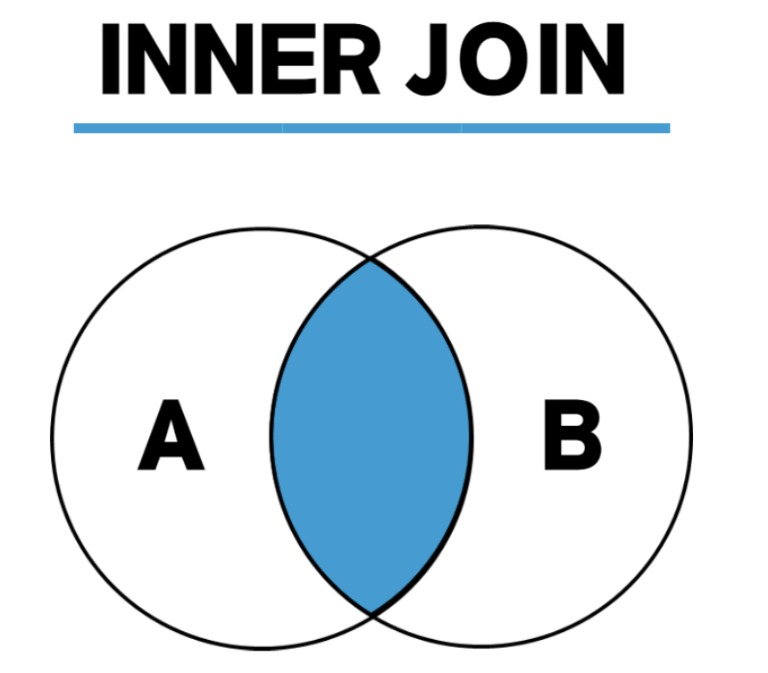
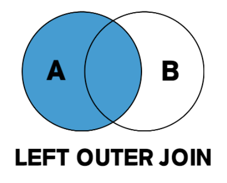
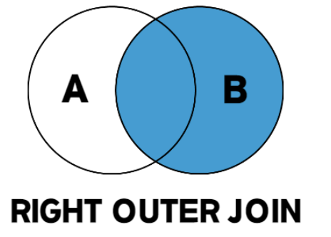
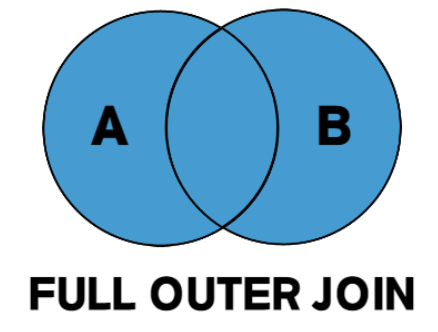
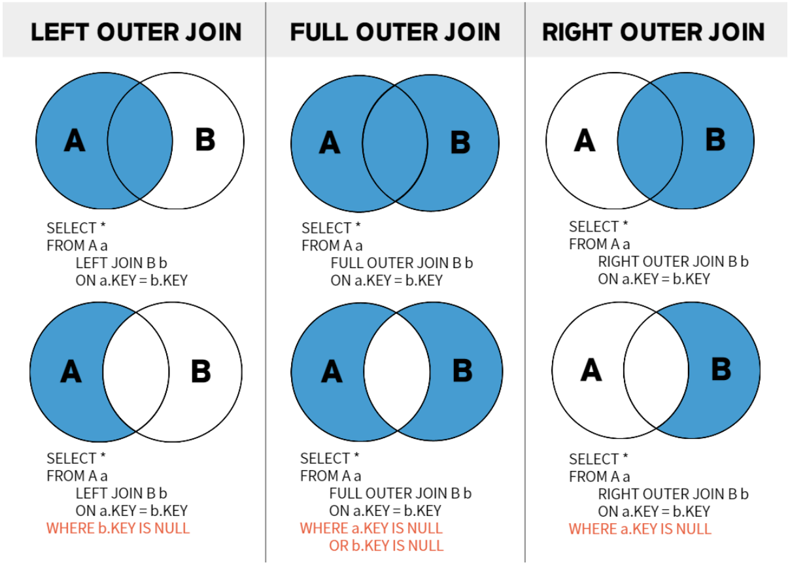

- Join
    - 두 개 이상의 테이블을 결합하여 원하는 데이터를 조회할 때 사용
    - INNER JOIN
        - 일반적으로 부르는 join
        - 조인하는 두 테이블에서 일치하는 데이터만 반환

      

    - OUTER JOIN
        - LEFT OUTER JOIN
            - 왼쪽 테이블의 모든 값이 출력되는 조인

         

        - RIGHT OUTER JOIN
            - 오른쪽 테이블의 모든 값이 출력되는 조인

          

        - FULL OUTER JOIN
            - 왼쪽 외부 조인과 오른쪽 외부 조인이 합쳐진 것

          
        
        

- N+1 문제
    - 연관 관계에서 발생하는 이슈로 연관 관계가 설정된 엔티티를 조회할 경우에 조회된 데이터 갯수(n) 만큼 연관관계의 조회 쿼리가 추가로 발생하여 데이터를 읽어오게 되는 문제
    - 원인: 한쪽 테이블만 조회하고 연결된 다른 테이블은 따로 조회하기 때문에 발생
- SpringBoot에서 N+1 예방법
    - 미리 두 테이블을 Join하여 한 번에 모든 데이터를 가져온다면 N+1 문제가 발생하지 않을 것. 이것을 가능하게 하는 것이 Fetch Join
    - Fetch Join: 연관된 엔티티나 컬렉션을 한 번에 같이 조회할 수 있는 기능